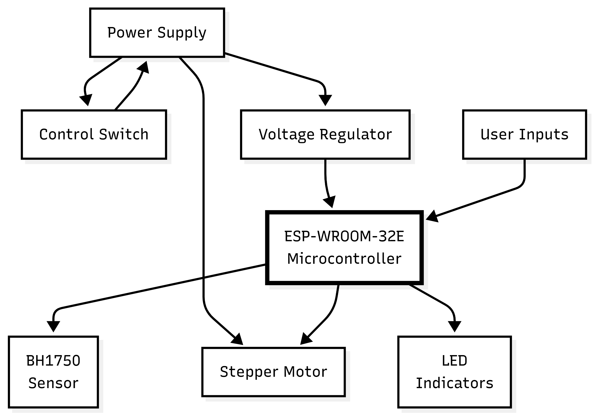

# LUMOS – IoT-Powered Automated Window Blinds

[](https://www.espressif.com/)
[](https://nextjs.org/)
[](https://www.3ds.com/products-services/solidworks/)
[](https://www.altium.com/)

**LUMOS** is an automated, light-sensitive smart window blind adjustment system designed to optimize indoor ambient lighting autonomously. Engineered as an accessible and cost-effective alternative to expensive imported motorized blinds, LUMOS continuously monitors ambient lux levels and adjusts the blind tilt angle using a stepper motor and universal joint shaft drive mechanism. It features a Next.js 15 web dashboard with real-time controls, historical data dynamic graphs, and AI-driven insights.

Developed as part of the **EN1190 Engineering Design Project** at the Department of Electronic and Telecommunication Engineering, University of Moratuwa.

---

## Key Features

* **Dual-Sensor Light Averaging**: Uses two BH1750 digital ambient light sensors to compute average lux, preventing false adjustments triggered by temporary light spikes or transient shadows.
* **30-Second Adjustment Cycle**: Periodically evaluates indoor ambient light against user-defined room thresholds and drives the stepper motor to achieve optimal tilt.
* **Universal Joint Drive Mechanism**: A custom-designed 3D-printed connecting shaft featuring dual universal joints (u-joints) transfers motor torque at variable angles from the wall-mounted enclosure to the blind wand.
* **Dual Operating Modes**:
  * **Automatic Mode**: Autonomous light sensing and motor control based on target light intensity.
  * **Manual Mode**: Direct web app override using tilt position presets (Fully Open, Mostly Open, Half Closed, Mostly Closed, Fully Closed) or exact angle sliders.
* **IoT Web Dashboard**: Built with Next.js 15, Tailwind CSS, and ShadCN UI, providing real-time data visualizer, custom control toggles, and sleep mode scheduling.
* **AI Assistant (Google Genkit)**: Analyzes historical sensor logs and motor activation patterns to provide natural-language insights and recommendations on room lighting behavior.

---

## System Architecture

The overall system architecture consists of an ESP32 processing unit reading dual BH1750 sensors over I2C, driving a 28BYJ-48 stepper motor, and communicating bidirectionally with the Next.js web application over Wi-Fi.



## Enclosure & Mechanical Design

The enclosure and output shaft mechanism were designed in **SOLIDWORKS** and 3D-printed using PLA.

* **Wall-Mountable Enclosure**: Compact 140 x 50 mm housing with dedicated cutouts for ambient light sensors, status LEDs, override buttons, and power connection.
* **Universal Joint Drive Shaft**: Flexible connecting mechanism utilizing dual u-joints to connect the motor inside the enclosure to the tilt wand on any standard window blind, accommodating variable mounting offsets.

*(Insert SOLIDWORKS Enclosure CAD image here: `docs/images/enclosure_cad.png`)*  
*(Insert Shaft Mechanism CAD image here: `docs/images/u_joint_shaft.png`)*  
*(Insert Final Assembled Prototype photo here: `docs/images/final_product.jpg`)*

---

## Web Dashboard & Software Architecture

The web application provides interactive monitoring and configuration capabilities.

```text
lumos-web-app/
 ├── app/                  # Next.js 15 App Router pages & API routes
 ├── components/           # React 18 UI components (ShadCN UI)
 ├── lib/                  # Utilities, Firebase Studio & Genkit setup
 └── public/               # Static assets & dashboard icons
```


## Getting Started

### Firmware Setup (ESP32)
1. Open the firmware sketch in **Arduino IDE**.
2. Install necessary dependencies via Library Manager:
   * `BH1750`
   * `AccelStepper`
   * `WiFi` / `HTTPClient`
3. Select board **ESP32 Dev Module** and upload the firmware to the ESP32 chip.

### Web Application Setup
1. Navigate to the web application directory:
   ```bash
   cd web-app
   ```

## Future Improvements

* **Solar Power Integration**: Adding small solar panels and lithium battery storage to eliminate reliance on grid power.
* **Multi-Blind Synchronization**: Controlling and grouping multiple blind controllers across larger commercial spaces.
* **Expanded Blind Mechanism Compatibility**: Adapting mechanical adapters to support vertical blinds, roller shades, and curtain tracks.

---
